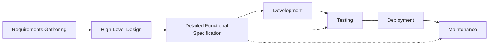

# Introduction to Detailed Functional Specifications

## What is a Detailed Functional Specification?

A Detailed Functional Specification (DFS) is a comprehensive document that bridges the gap between business requirements and technical implementation. It serves as a complete description of what a software system should do and how it should be implemented. Unlike high-level requirements documents, a DFS provides specific, actionable details that guide development teams in building the system correctly.

### Key Components of a DFS

A well-crafted DFS typically includes:

1. **Business Context**: The underlying business needs and goals the system addresses
2. **Functional Requirements**: Detailed descriptions of system behaviors and features
3. **User Interfaces**: Specifications for how users will interact with the system
4. **Technical Architecture**: System design, components, and interactions
5. **Data Models**: Structure and relationships of the data used by the system
6. **Implementation Details**: Coding standards, patterns, and approaches
7. **Testing Requirements**: Verification approaches to ensure quality
8. **Deployment Specifications**: How the system will be deployed and maintained

## Why DFS is Critical for Outsourcing Projects

In outsourcing contexts, a DFS becomes even more critical for several reasons:

### Knowledge Transfer

Outsourced development often involves teams who may not have direct access to business stakeholders or domain experts. A comprehensive DFS fills this gap by providing detailed context and requirements that would otherwise be communicated through in-person discussions.

### Clear Expectations

By documenting specific requirements and implementation details, a DFS establishes clear expectations for both the client and the development team, reducing misunderstandings and scope creep.

### Consistent Implementation

With development potentially distributed across different teams or locations, a DFS ensures that all developers work from the same blueprint, leading to more consistent implementation.

### Handover Documentation

When development is completed, a DFS serves as valuable documentation for maintenance and future enhancements, whether by the original team or a different team.

## Benefits of Using a DFS

### For Clients

- **Reduced Risk**: Clearly defined requirements minimize the risk of misinterpretation and rework
- **Quality Control**: Provides a baseline for acceptance testing and quality verification
- **Transparency**: Offers visibility into what is being built and how
- **Future-Proofing**: Creates documentation that remains valuable long after project completion

### For Development Teams

- **Clear Direction**: Eliminates guesswork about what needs to be built
- **Reduced Questions**: Comprehensive specifications mean fewer clarification questions
- **Efficient Planning**: Enables more accurate estimation and resource allocation
- **Better Collaboration**: Creates a shared understanding among all team members

## When to Create a DFS

A Detailed Functional Specification is most valuable in these scenarios:

- **Complex Systems**: When building systems with multiple components, integrations, or stakeholders
- **Distributed Teams**: When development is carried out by teams in different locations or organizations
- **Critical Applications**: For systems where correctness and reliability are paramount
- **Long-Term Projects**: For projects that will be maintained and enhanced over many years
- **Regulatory Environments**: When compliance with specific regulations must be documented and verified

## DFS in the Software Development Lifecycle

A DFS typically fits into the development lifecycle as follows:

The DFS is created after high-level design but before development begins. It then serves as a reference throughout development, testing, and even maintenance phases.

## Key Challenges in Creating a DFS

While valuable, creating a good DFS comes with challenges:

- **Balance of Detail**: Including enough detail to be useful without becoming overly prescriptive
- **Time Investment**: Creating a comprehensive DFS requires significant upfront time
- **Maintenance**: Keeping the DFS updated as requirements evolve
- **Technical Expertise**: Requiring both domain knowledge and technical understanding

This guide addresses these challenges by providing a structured template and practical examples that you can adapt to your specific project needs.

## Best Practices for DFS Creation

### 1. Involve the Right Stakeholders

Ensure that business analysts, domain experts, technical leads, and quality assurance specialists all contribute to and review the DFS.

### 2. Start with User Needs

Begin by clearly understanding the user needs and business goals that drive the system requirements.

### 3. Be Specific and Measurable

Write specifications that are specific, measurable, and testable rather than vague or ambiguous.

### 4. Use Visual Elements

Incorporate diagrams, mockups, and other visual elements to clarify complex concepts.

### 5. Consider Edge Cases

Document how the system should handle exceptions, errors, and edge cases, not just the happy path.

### 6. Make it Accessible

Write in clear language that is accessible to both technical and non-technical stakeholders.

### 7. Plan for Evolution

Establish a process for updating the DFS as requirements change or new information emerges.

## Next Steps

To start creating your own Detailed Functional Specification:

1. Review the [Template Structure](template-structure.md) to understand the components
2. Explore the [Template](../template/overview.md) for detailed guidance on each section
3. See the [E-Commerce Example](../example/overview.md) for a practical implementation
4. Learn how to [Customize](customization.md) the template for your needs