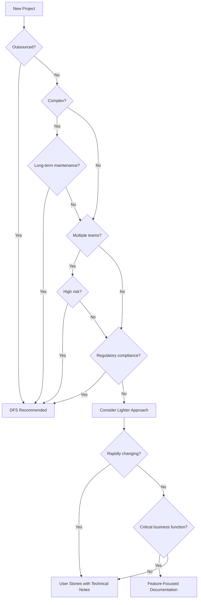

# When to Use a Detailed Functional Specification

While a Detailed Functional Specification (DFS) is a powerful tool, it's not always necessary or efficient for every project. This guide will help you determine when a DFS is most valuable and when simpler documentation might suffice.

## Ideal Scenarios for Using a DFS

### 1. Outsourced Development Projects

A DFS is particularly valuable when working with outsourced development teams for several reasons:

- **Limited Direct Access**: When face-to-face communication is limited, comprehensive documentation becomes more important
- **Different Business Contexts**: External teams may lack understanding of your business domain
- **Contractual Clarity**: A DFS can serve as part of the formal agreement about what will be delivered
- **Knowledge Retention**: Documentation ensures knowledge stays with your organization even if the vendor relationship changes

### 2. Complex Systems

Projects with significant complexity benefit from the thoroughness of a DFS:

- **Multiple Integrations**: Systems that connect with many external services or APIs
- **Complex Business Rules**: Applications with sophisticated business logic or calculations
- **Regulatory Requirements**: Systems that must comply with specific regulations
- **Large Data Models**: Projects with complex data relationships and transformations

### 3. Long-Term Maintenance

Systems that will be maintained over many years benefit from comprehensive documentation:

- **Legacy System Replacements**: When replacing systems that will require long-term support
- **Product Development**: For software products with long lifecycles
- **Mission-Critical Systems**: Applications where reliability and maintainability are essential

### 4. Multiple Team Collaboration

When multiple teams need to collaborate on development:

- **Distributed Teams**: When development teams are geographically separated
- **Cross-Functional Teams**: When different specialties (frontend, backend, QA) need coordination
- **Team Transitions**: When projects will transition between different teams

### 5. High-Risk Projects

Projects with significant business or technical risk:

- **Mission-Critical Applications**: Systems where failure would have serious consequences
- **Novel Domains**: Projects in unfamiliar business domains
- **Technical Exploration**: When using new or unfamiliar technologies

## When a Lighter Approach Might Be Better

In some situations, a full DFS might be overkill, and a lighter documentation approach would be more appropriate:

### 1. Small, Simple Projects

- **Limited Scope**: Projects with only a few features or screens
- **Single Developer**: When one developer can handle the entire implementation
- **Short Timeline**: Projects with very tight deadlines might not have time for extensive documentation

### 2. Highly Agile Environments

- **Rapidly Changing Requirements**: When requirements evolve too quickly for detailed documentation
- **Co-Located Teams**: When team members work closely together with good communication
- **Prototype Development**: When building a proof of concept rather than production code

### 3. Internal Tools with Limited Users

- **Developer Tools**: Applications built by developers for developers
- **Limited User Base**: Internal tools with a small, technically savvy user group
- **Minimal Integrations**: Standalone applications with few external dependencies

## Finding the Right Balance

Most projects fall somewhere between needing a full DFS and requiring very minimal documentation. Consider these approaches for finding the right balance:

### Scaled Documentation Approach

Adapt the level of detail based on project characteristics:

1. **Minimal**: User stories and basic technical notes
2. **Light**: User stories with acceptance criteria and architectural overview
3. **Standard**: Detailed feature specifications and technical design
4. **Comprehensive**: Full DFS with all sections

### Hybrid Approaches

Mix different documentation types based on project needs:

- **Feature-Based**: Create detailed specifications only for complex or critical features
- **Risk-Based**: Focus documentation efforts on high-risk areas
- **Phased**: Start with lightweight documentation and expand as needed

### Start with a Core Set

Begin with the most critical sections and expand if needed:

1. **Core Business Requirements**: User stories, personas, and business rules
2. **Key Technical Decisions**: Architecture approach and technology choices
3. **Interface Definitions**: API contracts and UI mockups
4. **Data Models**: Essential entities and relationships

## Decision Framework

Use this decision framework to determine if your project needs a DFS:

## Questions to Ask

When deciding whether to create a DFS, ask these questions:

1. **Communication**: How will team members communicate? Is face-to-face discussion limited?
2. **Complexity**: How complex is the system? Are there many integrations or business rules?
3. **Longevity**: How long will the system be maintained? Will the original developers always be available?
4. **Risk**: What happens if the system fails? What's the business impact?
5. **Team**: Who will be developing the system? Are they familiar with the domain?
6. **Timeline**: Is there time for detailed documentation? What's the trade-off?
7. **Change**: How stable are the requirements? How often will they change?

## Case Studies

### Case 1: E-Commerce Platform (Full DFS)

**Scenario**: An organization is outsourcing the development of a new e-commerce platform that will handle their core business operations for the next 5-10 years. It involves payment processing, inventory management, and integrations with multiple third-party services.

**Decision**: Create a full DFS because:
- The system is business-critical
- Development is outsourced
- The system will be maintained long-term
- Multiple integrations increase complexity
- Payment processing involves regulatory compliance

### Case 2: Internal Dashboard (Light Documentation)

**Scenario**: A small team needs to build an internal analytics dashboard that will be used by other developers in the organization. Requirements are still evolving as stakeholders determine exactly what metrics are needed.

**Decision**: Use lighter documentation because:
- The users are technically savvy
- Requirements are still evolving
- The team is small and co-located
- The system has limited integrations
- It's not a customer-facing application

### Case 3: Customer Portal (Hybrid Approach)

**Scenario**: A company is building a customer portal with both simple features (profile management, basic reporting) and complex features (custom analytics, integration with multiple backend systems).

**Decision**: Use a hybrid approach where:
- Simple features are documented with user stories and acceptance criteria
- Complex features get detailed functional specifications
- Technical architecture is fully documented
- API contracts are strictly defined

## Conclusion

The decision to create a DFS should be based on the specific characteristics and needs of your project. While a comprehensive DFS provides clear direction and aids in knowledge transfer, it requires significant effort to create and maintain.

By considering the factors outlined in this guide, you can make an informed decision about the appropriate level of documentation for your project, ensuring that you invest documentation effort where it will provide the most value.