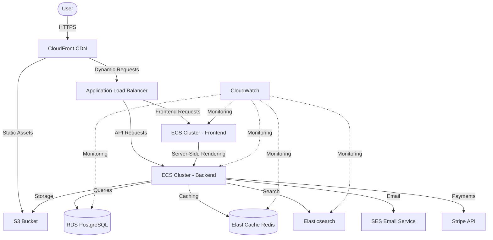
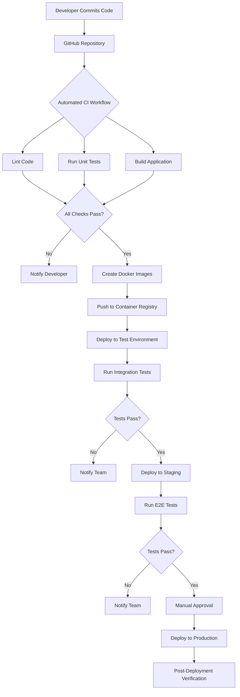
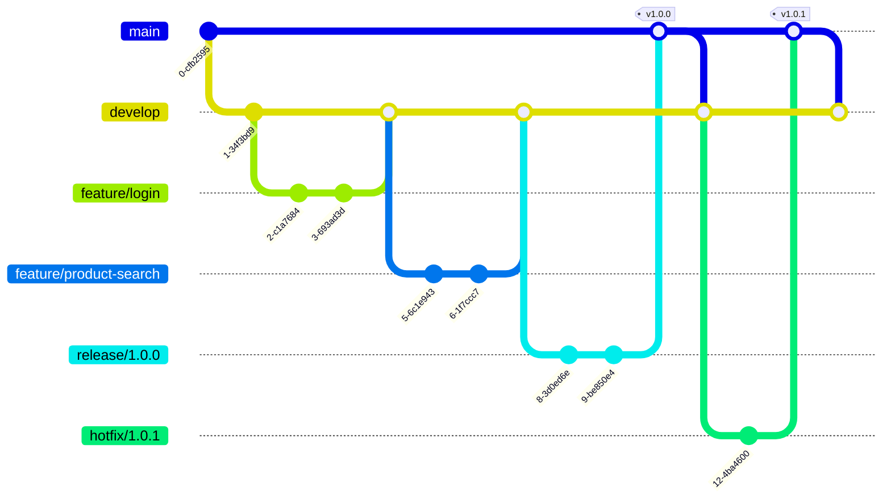

# Deployment Specifications

This section provides guidance on documenting the deployment architecture, environment configurations, CI/CD pipeline, and release management process.

## Deployment Architecture

Describe the overall deployment architecture, including infrastructure components and their relationships.

### Cloud Architecture Diagram



### Component Details

- **Frontend Hosting:**
  - NextJS application deployed on ECS Fargate containers
  - Static assets stored in S3 and served via CloudFront CDN
  - Server-side rendering handled by NextJS containers

- **Backend Services:**
  - NestJS API deployed in ECS Fargate containers
  - Auto-scaling based on CPU and memory metrics
  - API Gateway for request routing and throttling

- **Database and Cache:**
  - Amazon RDS for PostgreSQL with read replicas
  - ElastiCache for Redis caching
  - OpenSearch Service for product search functionality

## Environment Configurations

Document the different environments used in the development and deployment process.

### Environment Specifications

| Environment | Purpose | Infrastructure | Features |
|-------------|---------|---------------|----------|
| Development | Daily development work | Local Docker Compose | Hot-reload, debugging tools |
| Testing | Automated testing and QA | AWS with minimal resources | Test data, mocked services |
| Staging | Pre-production verification | AWS production-like setup | Anonymized data, real services |
| Production | Live customer-facing application | AWS with high-availability | Full monitoring, scaling |

### Configuration Management

Describe how environment-specific configurations are managed:

- Environment variables for sensitive configuration
- Configuration files for environment-specific settings
- Secrets management using AWS Secrets Manager or equivalent
- Feature flags for controlled feature rollout

### Configuration Example

```yaml
# Example environment configuration for different environments
development:
  database:
    host: localhost
    port: 5432
    username: ${DB_USER}
    password: ${DB_PASSWORD}
    database: ecommerce_dev
  redis:
    host: localhost
    port: 6379
  features:
    reviewSystem: true
    recommendationEngine: false

testing:
  database:
    host: test-db.example.com
    port: 5432
    username: ${DB_USER}
    password: ${DB_PASSWORD}
    database: ecommerce_test
  redis:
    host: test-redis.example.com
    port: 6379
  features:
    reviewSystem: true
    recommendationEngine: false

staging:
  database:
    host: staging-db.example.com
    port: 5432
    username: ${DB_USER}
    password: ${DB_PASSWORD}
    database: ecommerce_staging
  redis:
    host: staging-redis.example.com
    port: 6379
  features:
    reviewSystem: true
    recommendationEngine: true

production:
  database:
    host: ${DB_HOST}
    port: 5432
    username: ${DB_USER}
    password: ${DB_PASSWORD}
    database: ecommerce_prod
    ssl: true
    maxConnections: 100
  redis:
    host: ${REDIS_HOST}
    port: 6379
    cluster: true
  features:
    reviewSystem: true
    recommendationEngine: true
```

## CI/CD Pipeline

Document the continuous integration and deployment pipeline.

### Pipeline Diagram



### Pipeline Configuration

Document the CI/CD pipeline configuration:

```yaml
# GitHub Actions workflow example
name: CI/CD Pipeline

on:
  push:
    branches: [ main, develop ]
  pull_request:
    branches: [ main, develop ]

jobs:
  validate:
    runs-on: ubuntu-latest
    steps:
      - uses: actions/checkout@v3
      - name: Setup Node.js
        uses: actions/setup-node@v3
        with:
          node-version: '18'
          cache: 'npm'
      - name: Install dependencies
        run: npm ci
      - name: Lint code
        run: npm run lint:check
      - name: Type check
        run: npm run type:check
      - name: Check dependencies
        run: npm audit --production

  test:
    needs: validate
    runs-on: ubuntu-latest
    steps:
      - uses: actions/checkout@v3
      - name: Setup Node.js
        uses: actions/setup-node@v3
        with:
          node-version: '18'
          cache: 'npm'
      - name: Install dependencies
        run: npm ci
      - name: Run unit tests
        run: npm run test:unit
      - name: Upload coverage
        uses: actions/upload-artifact@v3
        with:
          name: coverage
          path: coverage/

  build:
    needs: test
    runs-on: ubuntu-latest
    steps:
      - uses: actions/checkout@v3
      - name: Setup Node.js
        uses: actions/setup-node@v3
        with:
          node-version: '18'
          cache: 'npm'
      - name: Install dependencies
        run: npm ci
      - name: Build application
        run: npm run build
      - name: Upload build artifacts
        uses: actions/upload-artifact@v3
        with:
          name: build
          path: |
            dist/
            .next/

  # Additional deployment jobs would be defined here
```

## Release Management

Document how software releases are managed and deployed.

### Versioning Strategy

Define the versioning approach:

- Semantic versioning (MAJOR.MINOR.PATCH)
- Version numbering rules and guidelines
- Release identification in code and artifacts

### Branching Strategy

Document the git branching strategy:



- `main` branch for production code
- `develop` branch for integration
- `feature/*` branches for development
- `release/*` branches for version preparation
- `hotfix/*` branches for critical fixes

### Release Process

Document the step-by-step release process:

1. **Preparation Phase**
   - Create release branch from develop
   - Update version numbers and changelog
   - Perform final QA and verification

2. **Release Phase**
   - Create pull request to main
   - Code review and approval
   - Merge to main and tag release
   - Deploy to production

3. **Post-Release Phase**
   - Post-deployment verification
   - Merge changes back to develop
   - Announce release to stakeholders

### Rollback Strategy

Document how to handle deployment failures:

- Monitoring triggers for rollback decision
- Process for emergency rollbacks
- Database rollback strategy
- Communication plan during incidents

## Deployment Runbook

Provide step-by-step instructions for manual deployment processes.

### Production Deployment Procedure

1. **Pre-Deployment Checks**
   - Verify all tests are passing
   - Ensure staging environment is stable
   - Check for any scheduled maintenance
   - Notify stakeholders of upcoming deployment

2. **Database Migration**
   ```bash
   # Generate migration from entity changes
   npm run migration:generate -- -n ProductAttributesUpdate
   
   # Run migrations with safety checks
   npm run migration:run
   ```

3. **Backend Deployment**
   - Build and tag backend Docker image
   - Push to container registry
   - Update ECS task definition
   - Deploy new version to ECS

4. **Frontend Deployment**
   - Build and tag frontend Docker image
   - Push to container registry
   - Deploy new version to ECS
   - Update CDN cache if needed

5. **Post-Deployment Verification**
   - Run smoke tests
   - Monitor error rates and response times
   - Verify database migrations
   - Check key business flows

### Rollback Procedure

```bash
# Rollback ECS deployment
aws ecs update-service \
  --cluster ecommerce-cluster \
  --service backend-service \
  --task-definition backend-service:PREVIOUS_VERSION

# Rollback database (if needed)
npm run migration:revert

# Rollback frontend
aws ecs update-service \
  --cluster ecommerce-cluster \
  --service frontend-service \
  --task-definition frontend-service:PREVIOUS_VERSION

# Clear CDN cache
aws cloudfront create-invalidation \
  --distribution-id DISTRIBUTION_ID \
  --paths "/*"
```

!!! warning "Critical Process"
    The deployment and rollback procedures are critical processes that should be regularly tested and updated to ensure they work as expected during actual incidents.