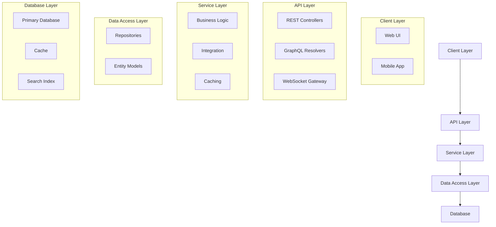
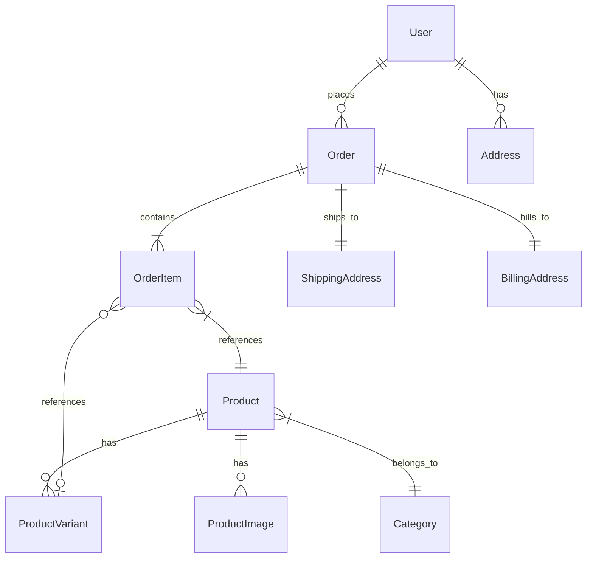
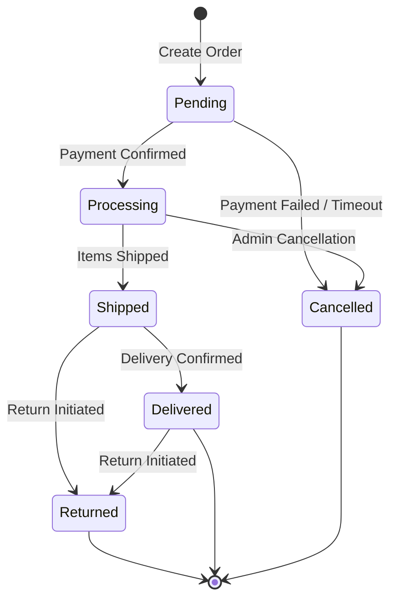
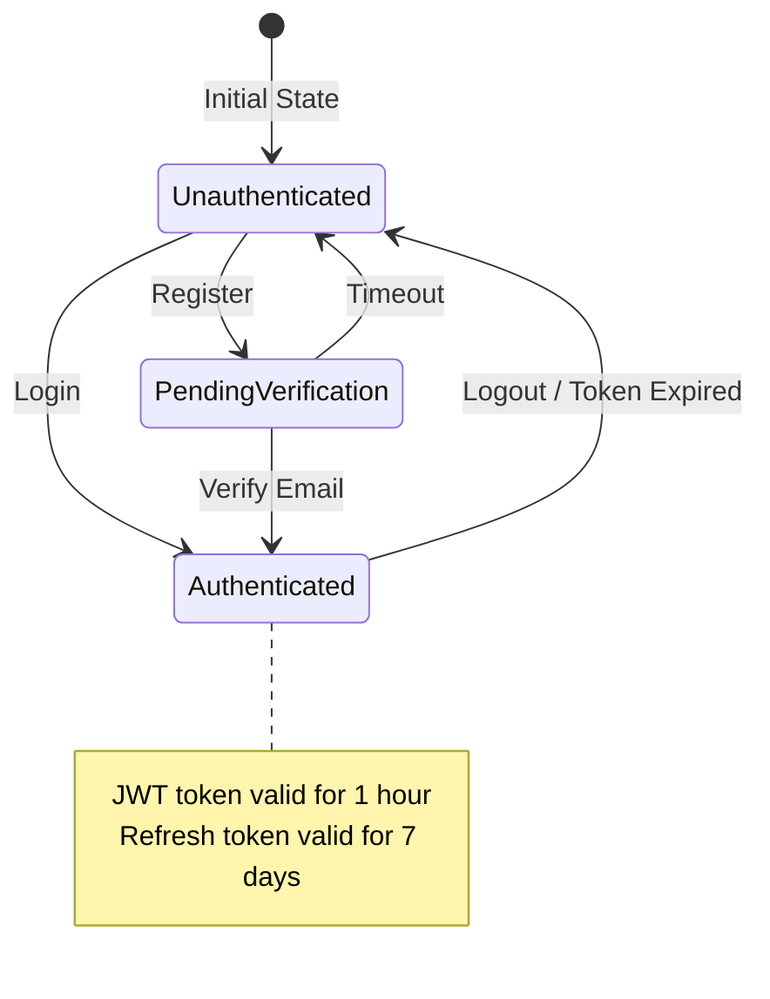

# Technical Specifications

This section provides guidance on documenting the technical architecture and design of a system, including architecture overview, data models, state diagrams, and security specifications.

## Architecture Overview

The architecture overview should describe the overall structure of the system, including main components and how they interact with each other.

### Architecture Diagram

Start with a high-level architecture diagram:



### Component Descriptions

Document each major component of the system:

```markdown
## Client Layer
- **Web UI**: Browser-based interface built with [framework]
- **Mobile App**: Native mobile application for iOS and Android
- **Admin Dashboard**: Internal management interface

## API Layer
- **REST API**: Primary interface for client applications
- **GraphQL API**: Flexible data fetching for complex screens
- **WebSocket Gateway**: Real-time notifications and updates

## Service Layer
- **Business Logic**: Core application functionality
- **Integration Services**: Connections to external systems
- **Caching**: Performance optimization layer

## Data Access Layer
- **Repositories**: Data access patterns and abstractions
- **Entity Models**: Database structure and relationships

## Database Layer
- **Relational Database**: Primary data storage (PostgreSQL)
- **In-Memory Cache**: High-speed data access (Redis)
- **Search Engine**: Optimized search functionality (Elasticsearch)
```

### Architectural Patterns

Document the key architectural patterns used in the system:

```markdown
## Architectural Patterns

### Microservices
The system is divided into these core microservices:
- **User Service**: Authentication and user management
- **Product Service**: Product catalog and inventory
- **Order Service**: Order processing and fulfillment
- **Payment Service**: Payment processing and refunds

### Event-Driven Architecture
- **Message Broker**: RabbitMQ for asynchronous communication
- **Event Types**: OrderCreated, PaymentProcessed, InventoryUpdated
- **Consumers**: Services that listen for and process events

### CQRS (Command Query Responsibility Segregation)
- **Command Stack**: Handles write operations with strong consistency
- **Query Stack**: Optimized for read operations with eventual consistency
- **Event Store**: Records all state changes for replay and audit
```

### Technology Stack

Outline the key technologies used:

```markdown
## Technology Stack

### Frontend
- **Framework**: React 18
- **State Management**: Redux Toolkit
- **API Client**: React Query
- **UI Library**: Material UI

### Backend
- **Framework**: NestJS
- **API**: REST and GraphQL
- **Authentication**: JWT with OAuth2
- **Validation**: Class Validator

### Database
- **Primary Database**: PostgreSQL 14
- **Cache**: Redis 7
- **Search**: Elasticsearch 8

### Infrastructure
- **Containerization**: Docker
- **Orchestration**: Kubernetes
- **CI/CD**: GitHub Actions
- **Monitoring**: Prometheus and Grafana
```

## Data Models

Document the data structure of the system, including entity relationships and schema design.

### Entity Relationship Diagram

Create an entity relationship diagram to illustrate data relationships:



### Entity Definitions

Define each entity in detail:

```markdown
## Entity: User

### Description
Represents a user account in the system.

### Properties
| Property | Type | Description | Constraints |
|----------|------|-------------|-------------|
| id | UUID | Unique identifier | Primary Key |
| email | String | User's email address | Unique, Not Null |
| passwordHash | String | Hashed password | Not Null |
| firstName | String | User's first name | Not Null |
| lastName | String | User's last name | Not Null |
| role | Enum | User role (Customer, Admin, etc.) | Not Null, Default: Customer |
| isVerified | Boolean | Email verification status | Not Null, Default: false |
| createdAt | DateTime | Account creation timestamp | Not Null |
| updatedAt | DateTime | Last update timestamp | Not Null |

### Relationships
- One-to-Many with Orders
- One-to-Many with Addresses

### Indexes
- B-tree index on email for login lookups
- B-tree index on role for filtering
```

### Database Schema

Provide database-specific schema information:

```markdown
## Database: PostgreSQL

### Schema: public

#### Table: users
```sql
CREATE TABLE users (
    id UUID PRIMARY KEY DEFAULT gen_random_uuid(),
    email VARCHAR(255) NOT NULL UNIQUE,
    password_hash VARCHAR(255) NOT NULL,
    first_name VARCHAR(100) NOT NULL,
    last_name VARCHAR(100) NOT NULL,
    role VARCHAR(20) NOT NULL DEFAULT 'customer',
    is_verified BOOLEAN NOT NULL DEFAULT false,
    created_at TIMESTAMP NOT NULL DEFAULT now(),
    updated_at TIMESTAMP NOT NULL DEFAULT now()
);

CREATE INDEX idx_users_email ON users(email);
CREATE INDEX idx_users_role ON users(role);
```
```

### Data Transfer Objects (DTOs)

Document the data transfer objects used for API communication:

```markdown
## DTO: CreateUserDto

### Purpose
Used to validate and transfer data for user creation.

### Properties
```typescript
class CreateUserDto {
  @IsEmail()
  @IsNotEmpty()
  email: string;

  @IsString()
  @MinLength(8)
  @Matches(/^(?=.*[a-z])(?=.*[A-Z])(?=.*\d)(?=.*[@$!%*?&])[A-Za-z\d@$!%*?&]{8,}$/, {
    message: 'Password must contain at least one uppercase letter, one lowercase letter, one number, and one special character',
  })
  password: string;

  @IsString()
  @IsNotEmpty()
  firstName: string;

  @IsString()
  @IsNotEmpty()
  lastName: string;
}
```
```

## State Diagrams

State diagrams illustrate how the system transitions between different states in response to events.

### Order State Diagram



### Authentication Flow



### Document state transitions in detail:

```markdown
## Order State Transitions

### Pending to Processing
- **Trigger**: Payment confirmation received from payment provider
- **Actions**:
  - Create payment record with reference to payment provider transaction
  - Allocate inventory for ordered items
  - Send order confirmation email to customer
  - Notify fulfillment team

### Processing to Shipped
- **Trigger**: Shipping confirmation entered by fulfillment team
- **Actions**:
  - Record shipping details (carrier, tracking number, etc.)
  - Update inventory records to remove allocated items
  - Send shipping confirmation email with tracking information
```

## Security Specifications

Document security requirements, authentication methods, and authorization rules.

### Authentication

```markdown
## Authentication

### JWT-Based Authentication
- **Token Format**: JSON Web Token (JWT)
- **Token Contents**:
  - User ID
  - User role
  - Token expiration (exp)
  - Token issue time (iat)
- **Access Token Lifetime**: 60 minutes
- **Refresh Token Lifetime**: 7 days
- **Token Storage**:
  - Frontend: HTTP-only cookies / localStorage (based on requirements)
  - Backend: Hashed refresh tokens stored in database

### Authentication Flows
- **Username/Password Authentication**:
  1. User submits credentials
  2. Server validates credentials
  3. Server issues access and refresh tokens
  4. Client stores tokens and includes access token in API requests

- **OAuth Integration**:
  1. User redirected to OAuth provider
  2. OAuth provider redirects back with authorization code
  3. Server exchanges code for tokens with OAuth provider
  4. Server creates or updates user record
  5. Server issues own access and refresh tokens

### Multi-Factor Authentication
- Optional second factor using TOTP (Time-based One-Time Password)
- Required for administrative actions
```

### Authorization

```markdown
## Authorization

### Role-Based Access Control (RBAC)
- **Roles**:
  - Guest: Unauthenticated users
  - Customer: Registered users
  - Staff: Internal support users
  - Admin: System administrators
  - Super Admin: Full system access

### Role Permissions
| Resource | Action | Guest | Customer | Staff | Admin | Super Admin |
|----------|--------|-------|----------|-------|-------|-------------|
| Products | View | ✓ | ✓ | ✓ | ✓ | ✓ |
| Products | Create | | | | ✓ | ✓ |
| Products | Update | | | ✓ | ✓ | ✓ |
| Products | Delete | | | | ✓ | ✓ |
| Orders | View Own | | ✓ | ✓ | ✓ | ✓ |
| Orders | View All | | | ✓ | ✓ | ✓ |
| Orders | Update | | | ✓ | ✓ | ✓ |
| Users | View Own | | ✓ | ✓ | ✓ | ✓ |
| Users | View All | | | | ✓ | ✓ |
| Users | Update Own | | ✓ | ✓ | ✓ | ✓ |
| Users | Update All | | | | ✓ | ✓ |
| Settings | View | | | | ✓ | ✓ |
| Settings | Update | | | | | ✓ |

### Implementation
- **API Level**: Guards/Middleware to check role-based permissions
- **Service Level**: Service methods check permissions before operations
- **UI Level**: Conditional rendering based on user permissions
```

### Data Protection

```markdown
## Data Protection

### Sensitive Data Handling
- **PII (Personally Identifiable Information)**:
  - Encrypted at rest using AES-256
  - Masked in logs
  - Restricted access to authorized personnel
- **Payment Information**:
  - Not stored directly; use payment provider tokens
  - Comply with PCI DSS requirements
- **Data Retention**:
  - User data retained for 2 years after last activity
  - Order data retained for 7 years for compliance
  - Audit logs retained for 1 year

### API Security
- **HTTPS**: All communications encrypted with TLS 1.3
- **Rate Limiting**: 100 requests per minute per IP/user
- **CORS Configuration**: Restrict to known origins
- **Content Security Policy**: Restrict resource loading
- **API Keys**: Required for server-to-server communication
```

### Security Monitoring and Response

```markdown
## Security Monitoring and Response

### Security Monitoring
- **Log Analysis**: Centralized logging with security event detection
- **Anomaly Detection**: Monitor for unusual access patterns
- **Vulnerability Scanning**: Weekly automated scans
- **Penetration Testing**: Quarterly by third-party security firm

### Incident Response
- **Alert Triggers**:
  - Multiple failed login attempts
  - Unusual access patterns
  - System permission changes
  - Configuration changes
- **Response Procedure**:
  1. Automatic lockout after 5 failed login attempts
  2. Notification to security team for suspicious activities
  3. Predefined playbooks for common security incidents
```

## Integration Architecture

Document how the system integrates with external systems and services.

### Integration Patterns

```markdown
## Integration Patterns

### REST API Integration
- **Authentication**: OAuth 2.0 / API Keys
- **Rate Limiting**: Exponential backoff for retries
- **Error Handling**: Circuit breaker pattern for fault tolerance

### Message-Based Integration
- **Message Broker**: RabbitMQ / Apache Kafka
- **Message Format**: JSON with schema validation
- **Delivery Guarantees**: At-least-once delivery
- **Error Handling**: Dead letter queues for failed messages

### File-Based Integration
- **File Formats**: CSV, XML, JSON
- **Transfer Methods**: SFTP, S3
- **Processing**: Batch processing with validation and error reporting
```

### External Systems Integration

```markdown
## External Systems

### Payment Processor (Stripe)
- **Integration Type**: REST API
- **Functionality**:
  - Payment processing
  - Subscription management
  - Refund processing
- **Authentication**: API key (server-side only)
- **Webhook Events**:
  - payment_intent.succeeded
  - payment_intent.payment_failed
  - charge.refunded

### Email Service (SendGrid)
- **Integration Type**: REST API
- **Functionality**:
  - Transactional emails
  - Marketing campaigns
  - Email templates
- **Authentication**: API key
- **Retry Policy**: 3 attempts with exponential backoff

### Shipping Provider (UPS)
- **Integration Type**: SOAP API
- **Functionality**:
  - Rate calculation
  - Label generation
  - Tracking information
- **Authentication**: Username/password with session token
- **Caching**: Rate information cached for 24 hours
```

## Performance and Scalability

Document performance requirements and scalability considerations.

```markdown
## Performance Requirements

### Response Time Targets
- **API Endpoints**: 95th percentile < 300ms
- **Page Load Time**: < 2s for major pages
- **Database Queries**: 95th percentile < 100ms

### Throughput Requirements
- **API Requests**: 100 requests/second peak
- **Concurrent Users**: 1,000 users at peak
- **Database Operations**: 500 transactions/second

### Scalability Approach
- **Horizontal Scaling**:
  - Stateless application servers
  - Load balancing with session affinity
  - Database read replicas
- **Vertical Scaling**:
  - Database primary instance
  - Search index servers
- **Caching Strategy**:
  - Redis for application caching
  - CDN for static assets
  - Browser caching with appropriate headers
```

## Reliability and Resilience

Document how the system maintains reliability and handles failures.

```markdown
## Reliability Design

### Availability Targets
- **System Uptime**: 99.9% (8.77 hours downtime per year)
- **Scheduled Maintenance**: Monthly 2-hour window

### Fault Tolerance
- **Service Redundancy**: Multiple application instances
- **Database Reliability**:
  - Primary-replica configuration
  - Point-in-time recovery
  - Regular backups
- **Graceful Degradation**:
  - Fallback mechanisms for non-critical features
  - Static cache for product catalog during outages
  - Queuing of non-critical operations

### Disaster Recovery
- **Recovery Time Objective (RTO)**: 1 hour
- **Recovery Point Objective (RPO)**: 5 minutes
- **Backup Strategy**:
  - Daily full backups
  - Continuous transaction log backups
  - Geo-redundant storage
- **Failover Process**:
  - Automated database failover
  - Manual application failover procedure
```

By including detailed technical specifications, you provide a clear blueprint for how the system should be designed and implemented, ensuring that it meets both functional requirements and technical standards.